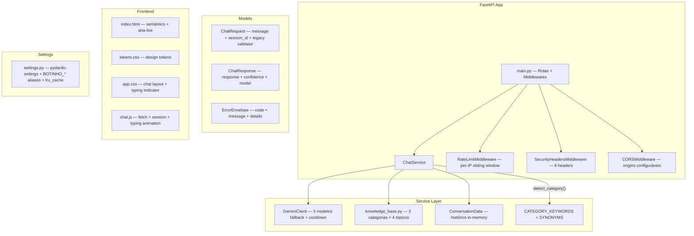

<div align="center">

# Botinho

[](https://github.com/ESousa97/imersao-dev-agentes-ai-google/actions/workflows/ci.yml)
[](https://www.codefactor.io/repository/github/esousa97/imersao-dev-agentes-ai-google)
[](https://opensource.org/licenses/MIT)
[](#)

**Assistente virtual com FastAPI e Google Gemini para suporte interno de TI e políticas corporativas — `GeminiClient` com fallback automático de modelo (3 candidatos), cooldown de quota com retry delay extraído da resposta, e knowledge-base fallback quando sem API key; `ChatService` com detecção de categoria por keywords + sinônimos, busca em base de conhecimento de 3 categorias / 12 tópicos, memória de conversa in-memory (últimas 20 mensagens); `RateLimitMiddleware` per-IP com sliding window, `SecurityHeadersMiddleware` com 6 headers incluindo CSP, Pydantic models com `@model_validator` para payload legacy (`mensagem` → `message`), frontend estático HTML/CSS/JS com design tokens CSS, CI com matrix Python 3.10+3.11+3.12, Ruff, Pytest (unit + integration) e pip-audit.**

</div>

---

> **⚠️ Projeto Arquivado**
> Este projeto não recebe mais atualizações ou correções. O código permanece disponível como referência e pode ser utilizado livremente sob a licença MIT. Fique à vontade para fazer fork caso deseje continuar o desenvolvimento.

---

## Índice

- [Sobre o Projeto](#sobre-o-projeto)
- [Funcionalidades](#funcionalidades)
- [Tecnologias](#tecnologias)
- [Arquitetura](#arquitetura)
- [Estrutura do Projeto](#estrutura-do-projeto)
- [Começando](#começando)
  - [Pré-requisitos](#pré-requisitos)
  - [Instalação](#instalação)
  - [Uso](#uso)
- [Scripts Disponíveis](#scripts-disponíveis)
- [API Reference](#api-reference)
- [Testes](#testes)
- [Qualidade e Segurança](#qualidade-e-segurança)
- [FAQ](#faq)
- [Licença](#licença)
- [Contato](#contato)

---

## Sobre o Projeto

Assistente virtual que entrega uma API HTTP e uma interface web de chat para atendimento técnico orientado por contexto de conversa. O projeto roda com fallback de base de conhecimento quando a chave do Gemini não está configurada, mantendo disponibilidade local para desenvolvimento e testes.

O repositório prioriza:

- **GeminiClient com 3 níveis de resiliência** — Fallback automático de modelo (lista de 3 candidatos: modelo configurado → `gemini-2.0-flash` → `gemini-2.0-flash-lite`), cooldown de quota com retry delay extraído por regex da mensagem de erro (10-600s), e knowledge-base fallback local quando sem API key ou SDK indisponível. `try_next_model()` avança para o próximo candidato em erros `RESOURCE_EXHAUSTED` ou `NOT_FOUND`
- **ChatService com detecção de categoria e memória** — `detect_category()` mapeia mensagens para 3 categorias (`politicas_empresa`, `procedimentos_ti`, `problemas_tecnicos`) via `CATEGORY_KEYWORDS` (8+6+8 keywords) + `SYNONYMS` (5 grupos com 15 aliases). `search_knowledge()` busca em `KNOWLEDGE_BASE` (3 categorias × 4 tópicos = 12 respostas). Memória de conversa in-memory com histórico limitado a 20 mensagens, últimas 10 enviadas como contexto Gemini
- **Segurança em 3 camadas** — `RateLimitMiddleware` per-IP com sliding window (`deque` + timestamp, configurável via `BOTINHO_RATE_LIMIT_REQUESTS`/`WINDOW_SECONDS`, padrão 60/60), `SecurityHeadersMiddleware` com 6 headers (`X-Content-Type-Options`, `X-Frame-Options`, `Referrer-Policy`, `Permissions-Policy`, CSP com `frame-ancestors 'none'`), CORS restrito por `BOTINHO_CORS_ALLOWED_ORIGINS`
- **Pydantic models com retrocompatibilidade** — `ChatRequest` com `@model_validator(mode="before")` que aceita campo legacy `mensagem` e normaliza para `message` (max 4000 chars). `ErrorEnvelope` com formato estruturado `{ "error": { "code", "message", "details?" } }`. `ConversationData` com `criado_em`, `ultima_categoria`, `historico`
- **Frontend estático com design tokens** — HTML semântico com `aria-live`, CSS com `tokens.css` (paleta, tipografia Inter, spacing, radius, shadows, gradients) e `app.css` (chat layout, typing indicator animado, responsivo ≤600px), JS com session ID baseado em timestamp+random
- **Settings via pydantic-settings** — `BaseSettings` com aliases `BOTINHO_*`, validators para CORS (split por vírgula) e modelo Gemini (normalização lowercase + typo fix `lastest→latest`), `@lru_cache` singleton
- **CI com matrix Python** — GitHub Actions com Python 3.10+3.11+3.12: Ruff (E/F/I/B/UP, line-length 100), Pytest (unit + integration), pip-audit

---

## Funcionalidades

- **Chat com IA** — Respostas geradas pelo Google Gemini com system instruction corporativo, temperatura 0.7, max 1024 tokens, top_p 0.95
- **Fallback de knowledge base** — 12 respostas predefinidas em 3 categorias (políticas, procedimentos TI, problemas técnicos) quando Gemini indisponível
- **Detecção de categoria** — Classificação automática por keywords e sinônimos para contextualizar respostas e manter continuidade de tópico
- **Memória de conversa** — Histórico in-memory por session_id (últimas 20 mensagens armazenadas, 10 enviadas como contexto ao Gemini)
- **Rate limiting** — 60 requisições/minuto per-IP com sliding window, retorna 429 com envelope de erro estruturado
- **Security headers** — CSP, X-Frame-Options DENY, Referrer-Policy, Permissions-Policy bloqueando câmera/microfone/geolocalização
- **Payload legacy** — Aceita `mensagem` (v1) e `message` (v2) no mesmo endpoint via model validator
- **Health check** — `GET /health` com status, versão e ambiente para probes de liveness/readiness
- **Diagnóstico** — Script `diagnostico.py` verifica Python, pip, dependências, porta 8000, arquivos, API key e conectividade
- **Interface web** — Chat responsivo com typing indicator animado, status badge, design tokens CSS

---

## Tecnologias


### Dependências

| Pacote | Versão | Função |
| --- | --- | --- |
| fastapi | ≥0.110.0 | Framework web assíncrono |
| uvicorn | ≥0.27.0 | Servidor ASGI |
| pydantic | ≥2.7.0 | Validação de dados e contratos |
| pydantic-settings | ≥2.2.1 | Configuração por variáveis de ambiente |
| google-genai | ≥1.0.0 | SDK Google Gemini |
| httpx | ≥0.27.0 | Client HTTP para testes |
| pytest | ≥8.0.0 | Testes (dev) |
| pytest-asyncio | ≥0.24.0 | Suporte async para pytest (dev) |
| ruff | ≥0.5.0 | Lint e formatação (dev) |
| pip-audit | ≥2.7.0 | Auditoria de dependências (dev) |

---

## Arquitetura



### Módulos e Responsabilidades

| Módulo | Responsabilidade |
| --- | --- |
| `main.py` | App factory, rotas (5 endpoints), 3 middlewares, 3 exception handlers |
| `settings.py` | `BaseSettings` com 11 campos, aliases `BOTINHO_*`, validators CORS/modelo, singleton `@lru_cache` |
| `security.py` | `RateLimitMiddleware` (sliding window per-IP) + `SecurityHeadersMiddleware` (6 headers CSP) |
| `models.py` | 6 Pydantic models: `ChatRequest`, `ChatResponse`, `ApiError`, `ErrorEnvelope`, `ConversationMessage`, `ConversationData` |
| `knowledge_base.py` | `KNOWLEDGE_BASE` (3 categorias × 4 tópicos), `CATEGORY_KEYWORDS` (3 × ~7 keywords), `SYNONYMS` (5 grupos) |
| `chat_service.py` | `GeminiClient` (3 modelos fallback, cooldown, create_chat), `ChatService` (detect_category, search_knowledge, converse, fallback local) |
| `static/` | HTML (semântico, aria-live), CSS (tokens + app), JS (session, fetch, typing indicator) |

### GeminiClient — Fluxo de Resiliência

1. Tenta modelo configurado → se `NOT_FOUND`, avança via `try_next_model()`
2. Se `RESOURCE_EXHAUSTED` (quota), tenta próximo modelo → se todos esgotados, entra em cooldown (delay extraído por regex, 10-600s)
3. Durante cooldown, todas as chamadas usam fallback local (knowledge base ou mensagem genérica)
4. Após cooldown expirar, retoma chamadas ao Gemini

---

## Estrutura do Projeto

```
imersao-dev-agentes-ai-google/
├── botinho.py                                  # Entrypoint retrocompatível — uvicorn.run() com reload em dev
├── diagnostico.py                              # Script de diagnóstico (Python, pip, deps, porta, API key, conectividade)
├── src/
│   └── botinho/
│       ├── __init__.py                         # Exporta app
│       ├── main.py                             # 5 rotas + 3 middlewares + 3 exception handlers
│       ├── settings.py                         # pydantic-settings com 11 campos BOTINHO_*
│       ├── security.py                         # RateLimitMiddleware + SecurityHeadersMiddleware
│       ├── models.py                           # 6 Pydantic models (ChatRequest com legacy validator)
│       ├── knowledge_base.py                   # 3 categorias × 4 tópicos + keywords + sinônimos
│       ├── services/
│       │   └── chat_service.py                 # GeminiClient (3 fallback) + ChatService (detect, search, converse)
│       └── static/
│           ├── index.html                      # HTML semântico com aria-live
│           ├── css/
│           │   ├── tokens.css                  # Design tokens (paleta, Inter, spacing, shadows)
│           │   └── app.css                     # Chat layout, typing indicator, responsivo
│           └── js/
│               └── chat.js                     # Session, fetch, typing animation
├── tests/
│   ├── unit/
│   │   └── test_chat_service.py                # 7 testes — categoria, knowledge, sync, quota, fallback modelo
│   └── integration/
│       └── test_api.py                         # 2 testes — health, legacy payload
├── docs/
│   ├── README.md                               # Índice da documentação
│   ├── architecture.md                         # Layers, directory map, decisions
│   ├── api.md                                  # 5 endpoints com payloads e respostas
│   ├── setup.md                                # Instalação e quality checks
│   └── deployment.md                           # Uvicorn, health checks, security baseline
├── scripts/
│   └── validate.ps1                            # Pipeline: ruff + pytest + pip-audit
├── .github/
│   ├── workflows/
│   │   └── ci.yml                              # Ruff + Pytest + pip-audit (matrix Python 3.10+3.11+3.12)
│   ├── ISSUE_TEMPLATE/
│   │   ├── bug_report.yml                      # Com aviso de archived
│   │   ├── feature_request.yml
│   │   └── config.yml                          # Blank issues disabled
│   ├── PULL_REQUEST_TEMPLATE.md
│   ├── CODEOWNERS                              # @ESousa97 com paths granulares
│   ├── FUNDING.yml
│   └── dependabot.yml                          # pip + GitHub Actions (PRs desabilitados)
├── requirements.txt                            # Runtime + tooling (fastapi, uvicorn, pydantic, google-genai, ruff, pytest, pip-audit)
├── pyproject.toml                              # Ruff config (E/F/I/B/UP, line-length 100, py310) + pytest paths
├── .editorconfig                               # UTF-8, LF, indent 2
├── .gitattributes                              # LF normalizado
├── .env.example                                # BOTINHO_*, GEMINI_API_KEY, CORS, rate limit
├── CHANGELOG.md                                # Keep a Changelog (v1.0.0 → v2.1.0 → v2.1.1)
├── CONTRIBUTING.md                             # Conventional Commits + quality checks
├── CODE_OF_CONDUCT.md                          # Contributor Covenant 2.1
├── SECURITY.md                                 # Política de disclosure
└── LICENSE                                     # MIT
```

---

## Começando

### Pré-requisitos

```bash
python --version   # >= 3.10
pip --version
```

(Opcional) Chave de API Gemini — [Obter no AI Studio](https://aistudio.google.com/app/apikey). Sem a chave, Botinho funciona em modo fallback com base de conhecimento local.

### Instalação

```bash
git clone https://github.com/ESousa97/imersao-dev-agentes-ai-google.git
cd imersao-dev-agentes-ai-google

# Ambiente virtual
python -m venv .venv

# Windows
.venv\Scripts\activate

# macOS/Linux
source .venv/bin/activate

# Dependências
python -m pip install --upgrade pip
python -m pip install -r requirements.txt

# Variáveis de ambiente
cp .env.example .env
# Configure GEMINI_API_KEY no .env (opcional)
```

### Uso

```bash
python botinho.py
```

Acesse `http://localhost:8000`. O chat web estará disponível com typing indicator e status badge "Online".

**Diagnóstico do ambiente:**

```bash
python diagnostico.py
```

---

## Scripts Disponíveis

```bash
# Aplicação
python botinho.py                                           # Inicia servidor (reload em dev)
python diagnostico.py                                       # Diagnóstico do ambiente

# Qualidade
./.venv/Scripts/python.exe -m ruff check .                  # Lint
./.venv/Scripts/python.exe -m pytest -q                     # Testes
./.venv/Scripts/python.exe -m pip_audit -r requirements.txt # Auditoria

# Pipeline local (PowerShell)
pwsh ./scripts/validate.ps1                                 # ruff + pytest + pip-audit
```

---

## API Reference

| Método | Endpoint | Descrição |
| --- | --- | --- |
| `GET` | `/` | Serve interface web do chat |
| `GET` | `/health` | Health probe — `{ status, version, environment }` |
| `POST` | `/api/chat` | Envia mensagem — aceita `message` ou `mensagem` (legacy) |
| `GET` | `/api/conversation/{session_id}` | Histórico da sessão |
| `GET` | `/api/stats` | Estatísticas runtime (total conversas, mensagens, sessões ativas) |

### POST /api/chat

**Request:**
```json
{
  "message": "Como resetar minha senha?",
  "session_id": "demo-1"
}
```

**Response (200):**
```json
{
  "response": "...",
  "confidence": 0.9,
  "context_found": true,
  "continues_topic": false,
  "session_id": "demo-1",
  "timestamp": "2026-02-21T18:00:00.000000",
  "model": "gemini-2.0-flash"
}
```

**Erro (422):**
```json
{
  "error": {
    "code": "validation_error",
    "message": "Payload inválido",
    "details": { "errors": [...] }
  }
}
```

---

## Testes

```bash
./.venv/Scripts/python.exe -m pytest -q
```

**7 testes unitários** (`test_chat_service.py`):

| Teste | Validação |
| --- | --- |
| `test_detect_category_procedimentos_ti` | "Preciso resetar minha senha" → `procedimentos_ti` |
| `test_search_knowledge_finds_wifi_guidance` | "Meu wifi caiu" → resposta com "Wi-Fi" |
| `test_converse_accepts_sync_send_message` | Sync `send_message` retorna "Resposta sync" |
| `test_gemini_client_accepts_non_awaitable_chat_create` | `create_chat` lida com retorno não-awaitable |
| `test_quota_error_enters_cooldown` | `RESOURCE_EXHAUSTED` → cooldown, segunda chamada usa fallback sem chamar Gemini |
| `test_not_found_model_retries_with_fallback` | `NOT_FOUND` → `try_next_model()` → sucesso no segundo modelo |
| `test_quota_error_retries_with_fallback_model` | Quota no modelo 1 → tenta modelo 2 → sucesso |

**2 testes de integração** (`test_api.py`):

| Teste | Validação |
| --- | --- |
| `test_health_endpoint_returns_ok` | `GET /health` → 200 + `status: "ok"` |
| `test_chat_endpoint_accepts_legacy_payload` | `POST /api/chat` com `mensagem` → 200 + response + session_id |

---

## Qualidade e Segurança

- **CI** — GitHub Actions com matrix Python 3.10+3.11+3.12 (branch `master`): Ruff (E/F/I/B/UP, line-length 100) → Pytest → pip-audit
- **Rate Limiting** — `RateLimitMiddleware` per-IP com sliding window (deque + timestamp), configurável via `BOTINHO_RATE_LIMIT_REQUESTS` (60) e `WINDOW_SECONDS` (60), retorna 429 com envelope estruturado
- **Security Headers** — `SecurityHeadersMiddleware` com `X-Content-Type-Options: nosniff`, `X-Frame-Options: DENY`, `Referrer-Policy: strict-origin-when-cross-origin`, `Permissions-Policy` (câmera/microfone/geolocalização bloqueados), CSP com `frame-ancestors 'none'` e `form-action 'self'`
- **CORS** — Restrito por `BOTINHO_CORS_ALLOWED_ORIGINS` (padrão localhost:8000)
- **Dependabot** — pip + GitHub Actions (PRs desabilitados — projeto archived)
- **Governança** — Issue templates YAML com aviso de archived, PR template com checklist, CODEOWNERS granular, FUNDING.yml

---

## FAQ

<details>
<summary><strong>O Botinho funciona sem API key do Gemini?</strong></summary>

Sim. Sem `GEMINI_API_KEY`, o `GeminiClient.available` é `False` e todas as chamadas usam o fallback local de `knowledge_base.py` (12 respostas em 3 categorias). O chat funciona normalmente para perguntas cobertas pela base de conhecimento, retornando mensagem genérica para temas fora do escopo.
</details>

<details>
<summary><strong>Como funciona o fallback de modelo Gemini?</strong></summary>

O `GeminiClient` mantém uma lista de 3 candidatos (modelo configurado → `gemini-2.0-flash` → `gemini-2.0-flash-lite`). Em erro `NOT_FOUND` (modelo inválido) ou `RESOURCE_EXHAUSTED` (quota), `try_next_model()` avança para o próximo. Se todos esgotarem quota, entra em cooldown (delay extraído por regex, 10-600s) e usa fallback local até expirar.
</details>

<details>
<summary><strong>O que é o campo `mensagem` no payload?</strong></summary>

É o campo da API v1. O `ChatRequest` usa `@model_validator(mode="before")` para aceitar `mensagem` e normalizar para `message`, mantendo retrocompatibilidade com clientes antigos sem breaking change.
</details>

<details>
<summary><strong>Como configurar o rate limit?</strong></summary>

Via variáveis de ambiente `BOTINHO_RATE_LIMIT_REQUESTS` (padrão 60) e `BOTINHO_RATE_LIMIT_WINDOW_SECONDS` (padrão 60). O middleware usa sliding window per-IP com `deque` de timestamps, retornando 429 com envelope `{ error: { code: "rate_limit_exceeded" } }`.
</details>

---

## Licença

Este projeto está sob a licença MIT. Veja o arquivo [LICENSE](LICENSE) para mais detalhes.

```
MIT License - você pode usar, copiar, modificar e distribuir este código.
```

---

## Contato

**José Enoque Costa de Sousa**

[](https://www.linkedin.com/in/enoque-sousa-bb89aa168/)
[](https://github.com/ESousa97)
[](https://enoquesousa.vercel.app)

---

<div align="center">

**[⬆ Voltar ao topo](#botinho)**

Feito com ❤️ por [José Enoque](https://github.com/ESousa97)

**Status do Projeto:** Archived — Sem novas atualizações

</div>
